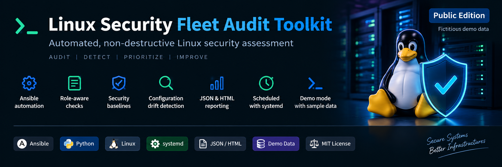
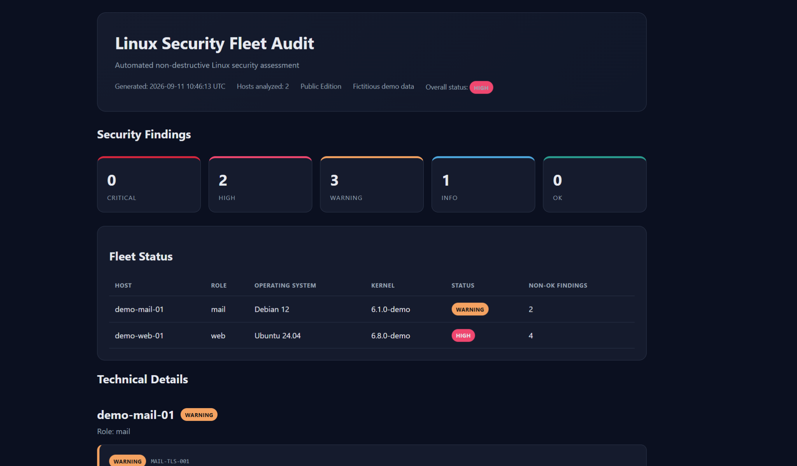

<p align="center">
  
</p>

<p align="center">
  
  
  
  
  
</p>

# Linux Security Fleet Audit Toolkit

Automated, non-destructive security auditing for Linux server fleets using **Ansible**, **Python** and **Bash**.

The toolkit collects security-relevant evidence from Linux systems, evaluates it through implemented security rules and approved baselines, classifies findings by severity and generates structured reports for operational review.

> **Public Edition**
>
> This repository contains a sanitized demonstration version of a toolkit designed around real-world system administration and defensive security auditing requirements.
>
> All hosts, IP addresses, evidence, baselines and demonstration findings included in this repository are fictitious.

---

## Overview

Linux Security Fleet Audit Toolkit turns repetitive Linux security verification activities into a repeatable, structured and auditable workflow.

The project separates:

- evidence collection;
- security analysis;
- baseline comparison;
- role-aware evaluation;
- reporting;
- orchestration and scheduling.

The toolkit follows a **non-destructive audit model**.

It detects, classifies and documents security-relevant conditions without automatically modifying the audited systems.

Remediation remains an explicit administrative decision.

---

## Report Preview

The Public Edition includes a fully sanitized demonstration workflow using fictitious host evidence and approved demo baselines.

<p align="center">
  
</p>

The report above is generated exclusively from fictitious demonstration data contained in this repository.

---

## Architecture

```text
Linux Hosts
    |
    v
Ansible Evidence Collection
    |
    v
Structured Host Evidence
    |
    v
Python Analysis Engine
    |
    +--> Generic Security Rules
    +--> Baseline Drift Detection
    +--> Role-Aware Checks
    |
    v
Severity-Classified Findings
    |
    +--> JSON Analysis
    +--> HTML Security Report
    |
    v
Operational Security Review
```

Collection, analysis and reporting are intentionally separated.

This makes the workflow easier to inspect, test, extend and audit.

Detailed architecture documentation is available in:

```text
docs/architecture.md
```

---

## Key Features

- Multi-host Linux evidence collection with Ansible
- Non-destructive remote inspection
- Python-based security analysis engine
- Privileged account analysis
- SSH security checks
- `authorized_keys` permission analysis
- Approved baseline comparison
- SSH configuration drift detection
- Role-aware analysis
- WordPress installation detection
- Postfix TLS policy analysis
- ClamAV socket permission analysis
- Severity-based classification
- Fleet-level status summaries
- Structured JSON output
- Professional HTML security reports
- One-command sanitized demo mode
- Live Ansible collection mode
- systemd scheduling templates
- Sanitized demonstration evidence
- Separation of public and runtime-sensitive data

---

## Implemented Security Controls

The Public Edition currently implements the following analysis controls.

### Generic Linux Controls

| Control ID | Description | Severity |
|---|---|---|
| `LINUX-UID0-001` | Unexpected UID 0 account detected | `HIGH` |
| `SSH-ROOT-001` | Direct SSH root login enabled | `HIGH` |
| `SSH-AUTH-001` | SSH password authentication enabled | `WARNING` |
| `SSH-KEY-001` | SSH public-key authentication disabled | `WARNING` |
| `SSH-KEYPERM-001` | Unsafe `authorized_keys` permissions | `WARNING` |

### Baseline Controls

| Control ID | Description | Severity |
|---|---|---|
| `BASELINE-SSH-001` | SSH configuration differs from approved baseline | Dynamic |

The baseline severity is determined by the highest-impact configuration difference.

### Web Role Controls

| Control ID | Description | Severity |
|---|---|---|
| `WEB-WP-001` | WordPress installation detected | `INFO` |

### Mail Role Controls

| Control ID | Description | Severity |
|---|---|---|
| `MAIL-TLS-001` | Postfix TLS protocol policy requires review | `WARNING` |
| `MAIL-CLAMAV-001` | ClamAV socket permissions require review | `WARNING` |

Detailed control documentation is available in:

```text
docs/controls.md
```

---

## Baseline Drift Detection

The analyzer can compare collected configuration against an approved per-host baseline.

The current Public Edition demonstrates SSH baseline comparison for:

```text
permitrootlogin
passwordauthentication
pubkeyauthentication
```

Example:

```text
Approved baseline:
permitrootlogin no

Observed configuration:
permitrootlogin yes

Result:
HIGH - SSH configuration differs from approved baseline
```

A baseline finding contains both the expected and observed values.

Baseline drift detection does not automatically restore configuration.

---

## Role-Aware Analysis

Hosts can be assigned a functional role.

The demo inventory includes:

```text
generic
web
mail
monitoring
```

Generic Linux controls can be evaluated across the fleet.

Role-specific controls are applied only when relevant.

For example:

```text
web  -> WordPress installation detection
mail -> Postfix TLS and ClamAV checks
```

The `monitoring` role is demonstrated in the inventory structure but does not currently have dedicated analysis controls.

---

## Evidence Collection

Evidence collection is performed through:

```text
playbooks/audit.yml
```

The current Ansible collector gathers information including:

```text
UID 0 accounts
effective SSH configuration
authorized_keys metadata
cron persistence files
systemd timers
listening network sockets
WordPress installation indicators
Postfix effective configuration
ClamAV socket metadata
```

Not every collected data point currently produces a dedicated finding.

This is intentional: the collection layer can retain evidence for future analysis rules without requiring changes to the evidence model.

---

## Severity Model

Findings are classified using five severity levels:

| Severity | Meaning |
|---|---|
| `CRITICAL` | Immediate security risk requiring urgent investigation |
| `HIGH` | Significant weakness or configuration drift requiring prompt review |
| `WARNING` | Security or configuration condition requiring assessment |
| `INFO` | Informational or contextual finding |
| `OK` | No relevant finding detected by the enabled checks |

The overall status of each host is determined by its highest active finding.

---

## Quick Start

Clone the repository:

```bash
git clone https://github.com/matteodilonardo41/linux-security-fleet-audit-toolkit.git
cd linux-security-fleet-audit-toolkit
```

Run the sanitized demonstration:

```bash
./run-audit.sh demo
```

Demo mode does not connect to external systems.

It uses:

```text
examples/demo-evidence/
baselines/demo/
```

The workflow automatically:

```text
1. Loads fictitious host evidence
2. Loads the approved demo baseline
3. Runs the Python security analyzer
4. Performs baseline drift detection
5. Classifies findings
6. Generates fleet-level JSON analysis
7. Generates the HTML security report
```

Generated output is written under:

```text
reports/
```

Reports are intentionally excluded from Git tracking.

---

## Live Collection

Live Ansible collection can be launched with:

```bash
./run-audit.sh collect <inventory>
```

Example syntax:

```bash
./run-audit.sh collect inventories/demo.ini
```

> The included demo inventory uses documentation-only TEST-NET addresses and does not represent a real infrastructure.

For real deployments, create a private inventory and review:

- SSH connectivity;
- Ansible privileges;
- sudo/become requirements;
- target hosts;
- collection commands;
- environment-specific security requirements.

Production inventories should never be committed to this public repository.

---

## Requirements

### Python

Python **3.10 or newer** is required.

Development testing was performed with:

```text
Python 3.12.3
```

The Python analyzer and HTML report generator use only the Python Standard Library.

### Ansible

Ansible is required for live evidence collection.

Install the project dependency with:

```bash
python3 -m pip install -r requirements.txt
```

Current requirement:

```text
ansible-core>=2.16
```

Development testing was performed with:

```text
ansible-core 2.21.2
```

---

## Demo Environment

The repository uses fictitious hosts such as:

```text
demo-web-01
demo-mail-01
demo-monitoring-01
demo-app-01
```

The demonstration inventory uses RFC 5737 TEST-NET addresses:

```text
192.0.2.10
192.0.2.20
192.0.2.30
192.0.2.40
```

These addresses are intended for documentation and examples.

No real infrastructure data is required to execute demo mode.

---

## Project Structure

```text
linux-security-fleet-audit-toolkit/
├── analyzer/
│   ├── analyzer.py
│   └── report_html.py
├── baselines/
│   └── demo/
├── docs/
│   ├── assets/
│   │   ├── banner.png
│   │   └── report-preview.png
│   ├── architecture.md
│   └── controls.md
├── examples/
│   └── demo-evidence/
├── inventories/
│   └── demo.ini
├── playbooks/
│   └── audit.yml
├── reports/
├── systemd/
│   ├── linux-security-fleet-audit.service
│   └── linux-security-fleet-audit.timer
├── .gitignore
├── LICENSE
├── README.md
├── requirements.txt
└── run-audit.sh
```

---

## Evidence and Privacy Model

Security audit evidence can contain sensitive infrastructure information.

The repository is configured to exclude runtime data such as:

```text
raw evidence
generated reports
production inventories
production baselines
environment files
credentials
private keys
certificates
temporary files
```

Only sanitized demonstration material should be committed to the Public Edition.

---

## systemd Scheduling

Example systemd templates are included under:

```text
systemd/
```

Files:

```text
linux-security-fleet-audit.service
linux-security-fleet-audit.timer
```

The templates use the generic installation path:

```text
/opt/linux-security-fleet-audit-toolkit
```

The timer demonstrates daily execution with:

```ini
Persistent=true
RandomizedDelaySec=15m
```

The included service currently launches demo mode and is intended as a safe public template.

For a real deployment, review and adapt the execution mode, installation path, inventory and permissions before enabling the service.

---

## Generated Findings

Each analyzer finding uses a consistent structure:

```text
severity
control_id
title
evidence
recommendation
```

Example:

```json
{
  "severity": "HIGH",
  "control_id": "BASELINE-SSH-001",
  "title": "SSH configuration differs from approved baseline",
  "evidence": [
    "setting=permitrootlogin",
    "expected=no",
    "current=yes"
  ]
}
```

This structure is reused by both JSON output and the HTML reporting layer.

---

## Non-Destructive Design

The toolkit is designed to detect and document security-relevant conditions.

It does not automatically:

```text
modify SSH configuration
create or delete users
change authorized_keys permissions
modify Postfix configuration
modify ClamAV configuration
remove files
apply baseline remediation
```

The administrator remains responsible for validating findings and deciding whether remediation is appropriate.

---

## Security Philosophy

The project follows a simple operational model:

```text
Detect -> Classify -> Document -> Review
```

Security assessment and remediation are intentionally separated.

This reduces unintended changes and preserves administrative control over production systems.

---

## License

This project is released under the **MIT License**.

See:

```text
LICENSE
```

for the complete license text.

---

## Disclaimer

This project is intended for:

- system administration;
- defensive security auditing;
- automation;
- educational and demonstration purposes.

Review the source code, inventories, baselines and privilege requirements before using the toolkit in a production environment.

---

## Author

**Matteo Di Lonardo**

System Administrator focused on Linux infrastructure, automation, virtualization, monitoring and defensive security.

GitHub:

```text
https://github.com/matteodilonardo41
```
